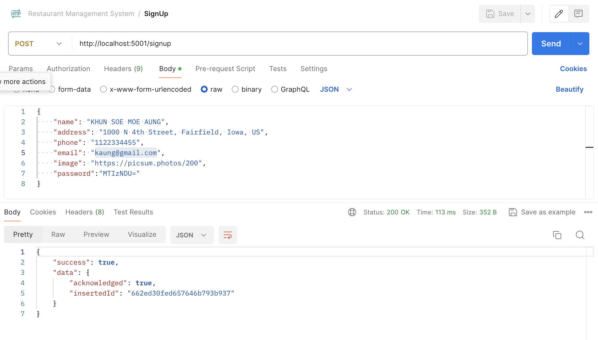
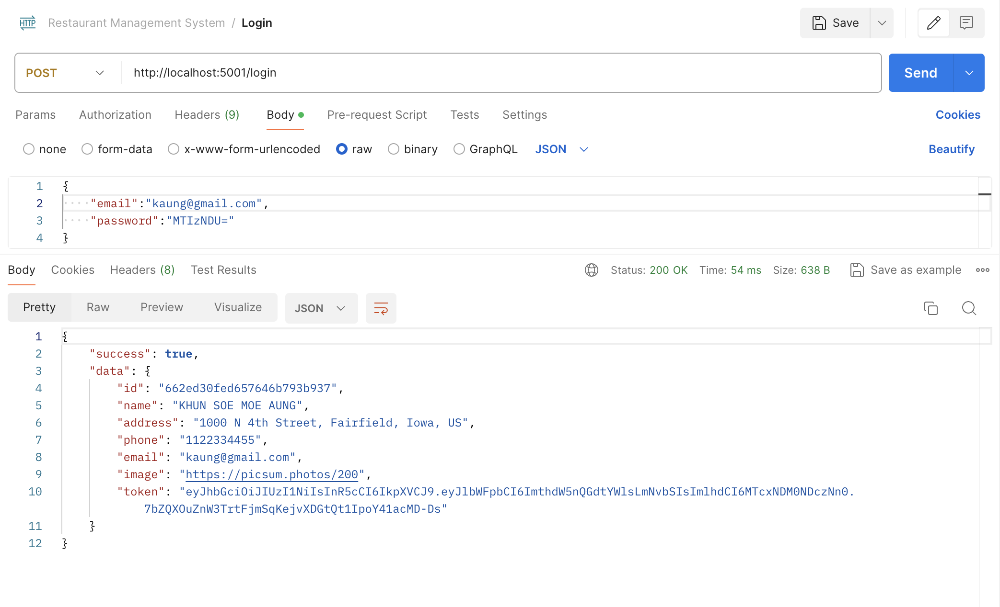
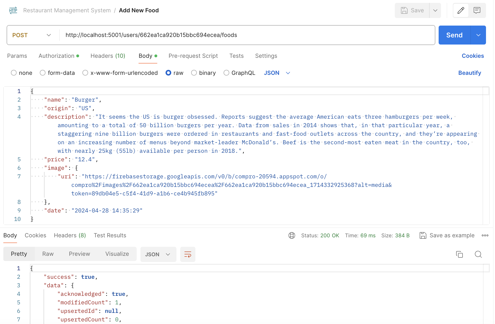
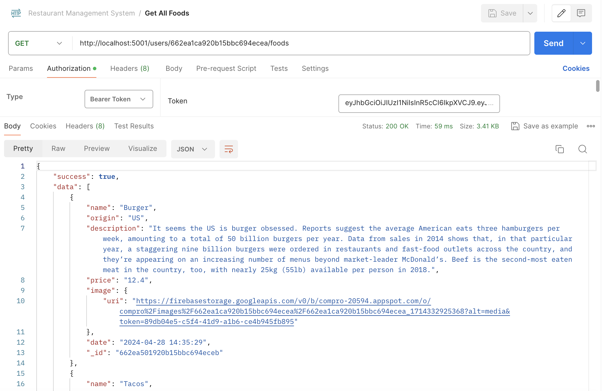
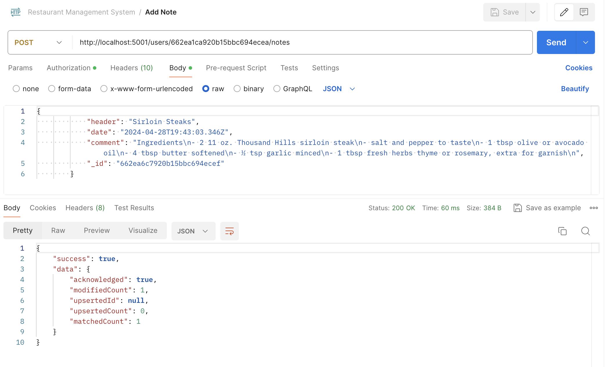
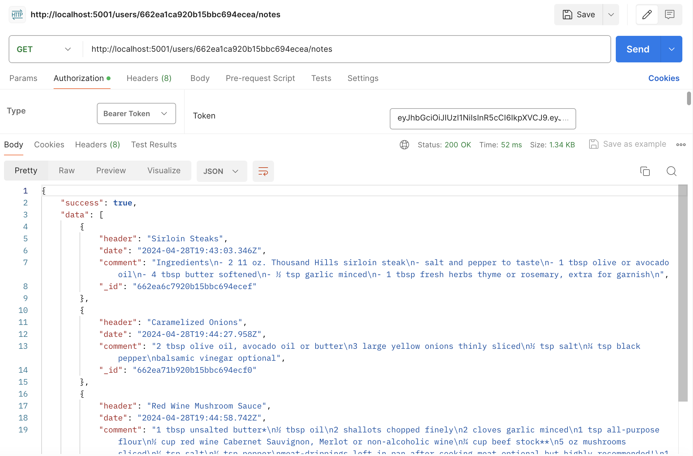
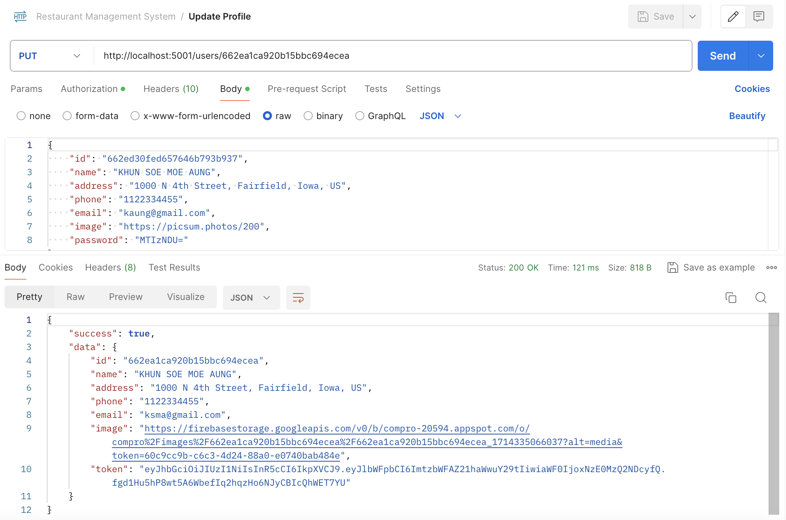

# Restaurant Management System
Backend Web Services to provide REST API for front ends mobile app (Restaurant Management App) using using NodeJS, Express, MongoDB and Firebase.

The REST API end points are comsumed by the front-end project. It was Mobile Application using React Native Framework for Android and iOS. The github repository is available [here](https://github.com/ksmaprince/Restaurant-Management-App)

## Screenshots for some API end points

## Sing Up User

## User Login

## Add New Food

## Get All Foods

## Add New Note

## Get All Notes

## Update Profile

The REST API end points are comsumed by the front-end project. It was Mobile Application using React Native Framework for Android and iOS. The github repository is available [here](https://github.com/ksmaprince/Restaurant-Management-App)
